# Fluxo de SDLC e checkpoints de autoverificação do workshop

> **Caminho:** [Kit da equipe](../README.md) › [Documentação](README.md) › **Fluxo de SDLC**

**Guia dos contratos entre as etapas do desafio individual** — resume os checkpoints de autoverificação sem alterar cronogramas nem ampliar entregas.

| Campo | Valor |
|---|---|
| **Público-alvo** | Todo participante |
| **Pré-requisitos** | Ler [`00-TEAM-FLOW.md`](../00-TEAM-FLOW.md) |
| **Resultado esperado** | Entender o que cada etapa produz e o que verificar antes de avançar |

---

## Visão geral do fluxo

```mermaid
%%{init: {'theme':'neutral','themeVariables':{'fontFamily':'ui-sans-serif, system-ui, sans-serif','primaryColor':'#F5F5F5','primaryTextColor':'#171717','primaryBorderColor':'#171717','lineColor':'#525252','secondaryColor':'#FFFFFF','tertiaryColor':'#FAFAFA','background':'#FFFFFF'}}}%%
flowchart LR
    classDef step fill:#F5F5F5,stroke:#171717,color:#171717
    classDef check fill:#FFFFFF,stroke:#525252,color:#171717
    classDef result fill:#FFFFFF,stroke:#171717,color:#171717,stroke-width:2px

    E1["Etapa 1<br/>Arqueologia<br/>14:00-14:50"]:::step
    C1["Autoverificação C1"]:::check
    E2["Etapa 2<br/>Especificação<br/>14:50-15:30"]:::step
    C2["Autoverificação C2"]:::check
    E3["Etapa 3<br/>Implementação e migração de dados<br/>15:30-17:10"]:::step
    C3["Verificação de submissão C3"]:::check
    ACCEPT["Validação do juiz<br/>17:10-17:40"]:::result

    E1 --> C1 --> E2 --> C2 --> E3 --> C3 --> ACCEPT
```



---

## Cronograma oficial do desafio

Consulte [`00-TEAM-FLOW.md`](../00-TEAM-FLOW.md) para ver o cronograma que é a fonte de verdade. Resumo:

| Horário | Etapa | Agente | Resultado esperado |
|---|---|---|---|
| 14:00-14:50 | 1 — Arqueologia | `@archaeologist` + `@dba` para descoberta de dados | Evidências legadas, regras de validação descobertas, população medida e questões em aberto |
| 14:50-15:30 | 2 — Especificação | `@architect` + `@dba` para design da migração | `spec.md`, `plan.md`, `tasks.md`, design da migração e testes de reconciliação |
| 15:30-17:10 | 3 — Implementação e migração de dados | `@builder` + `@dba` | Incremento testado, PostgreSQL populado e evidências de reconciliação e consulta |
| 17:10-17:40 | Validação final do juiz | juiz | Submissão validada ou bloqueios registrados |

> [!NOTE]
> A Etapa 4 — Evolução é mantida no kit para o trabalho pós-desafio, mas não é usada no desafio individual. O desafio termina na Etapa 3 e na validação do juiz. Consulte a [ADR-0003](adr/0003-individual-challenge-format.md).

---

## Estrutura formal dos artefatos

Os artefatos formais do Spec-Kit para uma funcionalidade ficam em:

```text
.spec/<NNN>-<feature>/
├── spec.md          # EARS requirements and source traceability
├── research.md      # decisions, rationale, alternatives, risks
├── plan.md          # Modular Monolith design and delivery view
├── data-model.md    # source-to-target entities and fields
├── contracts/       # /api/v1 contracts, or a README stating why none
├── quickstart.md    # runnable validation scenarios
├── tasks.md         # ordered tasks, tests, verification ledger
└── checklists/      # requirement-quality gates
```

`02-modern-spec/` armazena apenas material de apoio e decisões de escopo. Não crie artefatos formais paralelos fora da pasta da funcionalidade.

---

## Checklist dos checkpoints de autoverificação

| Checkpoint | Quando | Verificar antes de avançar | Pergunta de confirmação |
|---|---|---|---|
| **C1** | Fim da Etapa 1 | Escopo, evidências da fonte, população medida, prontidão da extração e questões em aberto | “Tenho evidências tanto do comportamento quanto dos dados de origem?” |
| **C2** | Fim da Etapa 2 | `spec.md`, `plan.md`, `tasks.md`, design da migração e testes de reconciliação do QA | “Consigo migrar e validar a população autorizada completa?” |
| **C3** | Fim da Etapa 3 | Incremento funcional, PostgreSQL populado, evidências de reconciliação, consulta e recuperação e checklist do PR de submissão | “A aceitação dos dados está completa e o que permanece bloqueado?” |

Uma lacuna no checkpoint não autoriza inventar requisitos, fontes legadas ou arquitetura — reduza a abrangência da capacidade ou registre o item pendente. Não reduza a população de beneficiários migrada nem o padrão de verificação.

As responsabilidades do DBA abrangem o [ciclo de vida dos dados](DATA-MIGRATION.md) desde a prontidão da fonte antes da Etapa 1. O escopo da funcionalidade pode ser estreito; a cobertura da população de beneficiários não pode ser reduzida silenciosamente. Extração indisponível ou diferenças de dados não resolvidas bloqueiam a aceitação da migração, mesmo quando o build passa.

---

## Rastreabilidade

Antes de escrever EARS, leia as fontes atribuídas e verifique o comportamento selecionado. Todo `REQ-NNN` precisa de um `source_legacy:` sem marcador nas 20 linhas seguintes, usando um path Natural/JCL/DDM/FDT real e compatível ou `[GREENFIELD]` justificado. A CI verifica essa sintaxe e a existência do arquivo, não a leitura humana nem a veracidade do comportamento.

---

## Branches

Crie `spec/<NNN>-<feature>` a partir de `develop` durante a Etapa 2. Depois, crie `impl/<NNN>-<feature>`, também a partir de `develop`, durante a Etapa 3. O PR de submissão é `impl/<NNN>-<feature>` → `develop` no repositório do participante. Não existe branch `stage`, e os prefixos de branch da Etapa 4 não são usados no desafio.

---

### Continue lendo

| Anterior | Próximo |
|---|---|
| [Matriz de personas e agentes](persona-agent-matrix.md)<br/><sub>Quais responsabilidades estão ativas em cada etapa.</sub> | [Agentes explicados](4-agents-explained.md)<br/><sub>Por que existem agentes de etapa.</sub> |

<sub>[Voltar ao índice do kit](../README.md)</sub>
